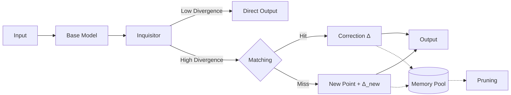
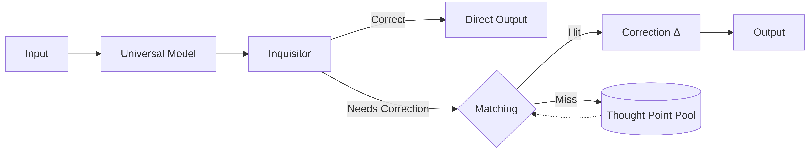
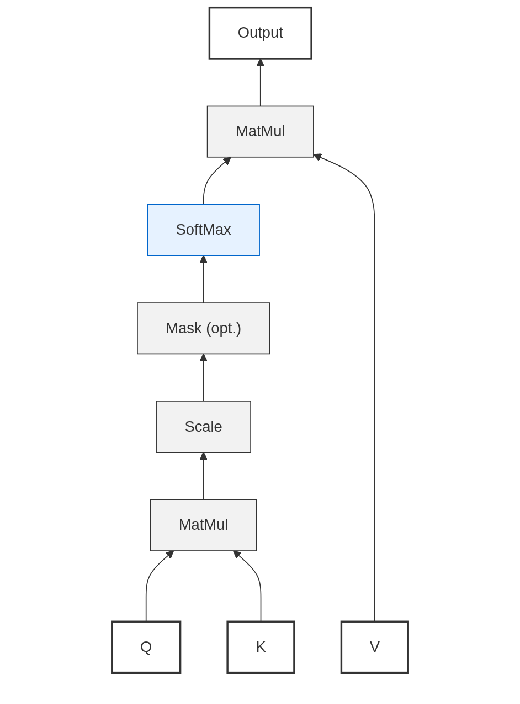
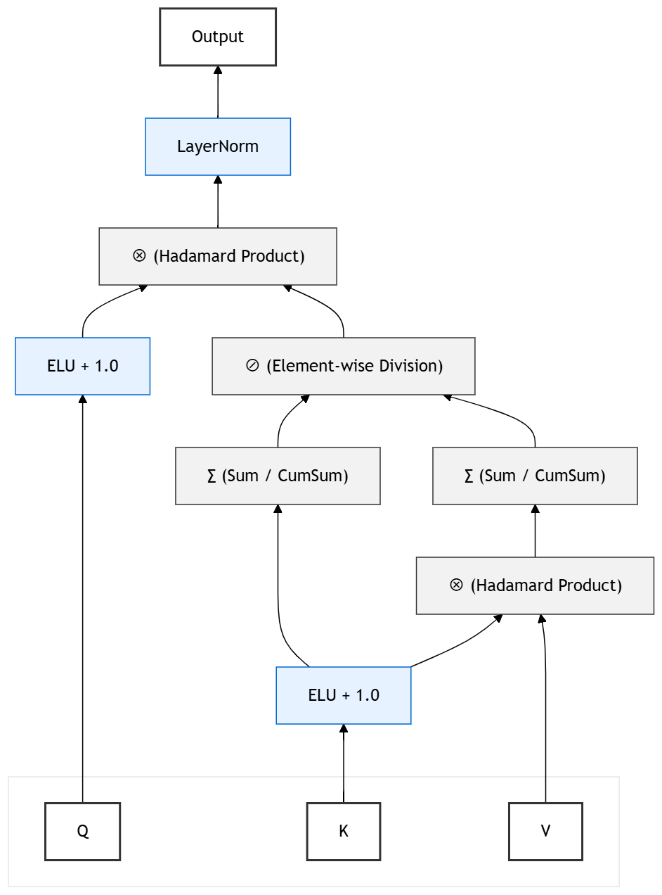

# Thought Points and Divergence as the Basis for Model Self-Sustained Learning (DATP & DAM)

[](LICENSE)

[**中文版本**](#chinese-version) | [**English Version**](#english-version)

---

<a id="english-version"></a>

## English Version

To address the dual challenges faced by deep learning models after deployment—**the inability to perform real-time, self-sustained learning** (due to catastrophic forgetting and high fine-tuning costs) and the **quadratic scaling of Transformer self-attention computational complexity with sequence length ($O(n^2)$)**—this paper, inspired by the **Dual-Process Theory** from human cognitive science, proposes a novel academic and engineering framework: **Divide-and-Aggregate Thought-Point Network (DATP)** and **Divergence Aggregation Mechanism (DAM)**.

---

### 🚀 Core Highlights

1.  **Zero-Parameter Frozen Base Continual Learning (DATP)**
    *   Inspired by the brain's Dual-Process Theory (fast thinking vs. slow thinking). The pre-trained universal base model parameters are completely frozen (System 1). A decoupled **Judge Network** perceives cognitive boundaries and introduces a dynamically evolving **Thought-Point Pool** in the non-parametric space (System 2).
    *   Endows the model with streaming, immediate error correction and self-sustained learning capabilities **without modifying the base parameters and without triggering catastrophic forgetting**.

2.  **A Novel Attention Mechanism Replacement Operator (DAM)**
    *   Completely abandons the traditional Q, K matrix multiplication, replacing the standard similarity metric with **Divergence**.
    *   Successfully reduces the time complexity of autoregressive inference to **$O(nd)$** and lowers inference memory footprint from standard attention's $O(nd)$ to a constant **$O(d)$** level, completely independent of sequence length (requiring only two $d$-dimensional accumulation vectors), offering significant advantages for edge devices and long-context scenarios.

3.  **Biologically Inspired Evolutionary Dynamics**
    *   Introduces dynamic **Spatial Aggregation** and **Biological Forgetting** mechanisms. Scattered "isolated error points" are progressively condensed into local knowledge regions, and low-health thought points caused by noise are automatically pruned, ensuring the boundedness and generalization capability of the thought-point pool.

---

### 📐 Architecture Design

#### 1. Thought-Point and Divergence Cognitive Loop
Traditional neural network's "learn → predict" process is one-way, whereas DATP implements a cyclical process of "predict → evaluate → learn → re-predict," enabling positive knowledge accumulation through interaction.

#### 2. DATP Global Routing Decision
The model evaluates the base model's probability of making an error $P(\text{Wrong}|x)$ via the decoupled Judge, thus enabling Compute-on-Demand:
*   **Fast Path (System 1)**: The Judge identifies low risk, and the output is directly produced by the frozen base network, keeping latency extremely low.
*   **Slow Path (System 2)**: The Judge identifies high risk, triggering divergence calculation. If an existing thought point is hit, a local expert is called for **residual patch correction**; if not, a new thought point is instantly created for **online, immediate learning**.

##### 🖼️ DATP Architecture Design Diagram
<p align="center">
  
</p>
<p align="center">
  
</p>

---

#### 3. DAM Operator vs. Traditional SDPA Mechanism Comparison
The DAM operator breaks the quadratic complexity of the standard Scaled Dot-Product Attention (SDPA) by introducing divergence aggregation, enabling more efficient streaming state updates.

##### 🖼️ Architecture Mechanism Comparison
<table>
  <tr>
    <td align="center"><b>Standard Scaled Dot-Product Attention (SDPA)</b></td>
    <td align="center"><b>Divergence Aggregation Mechanism (DAM)</b></td>
  </tr>
  <tr>
    <td></td>
    <td></td>
  </tr>
</table>

---

### 📈 Experimental Results

*   **Language Modeling (WikiText-103)**: Under conditions of 84MB parameters and a sequence length of 1024, the DAM operator achieved a perplexity of **20.69**, maintaining performance comparable to the standard attention mechanism while incurring only linear inference memory overhead.
*   **Regression Tasks**: On five standard regression datasets, DATP's evolutionary dynamics successfully compressed the number of thought points by approximately **72% ~ 75%**, controlled single-sample inference latency within **0.08 - 0.63 milliseconds**, and maintained stable prediction performance.

---

### 🛠️ Quick Start

#### 1. Environment Setup
```bash
git clone https://github.com/QZL2004qz1/DATP_DAM.git
cd DATP_DAM
pip install -r requirements.txt

# Reproduce DATP algorithm results
python DATP.py

# Reproduce DAM algorithm results
python DAM.py
